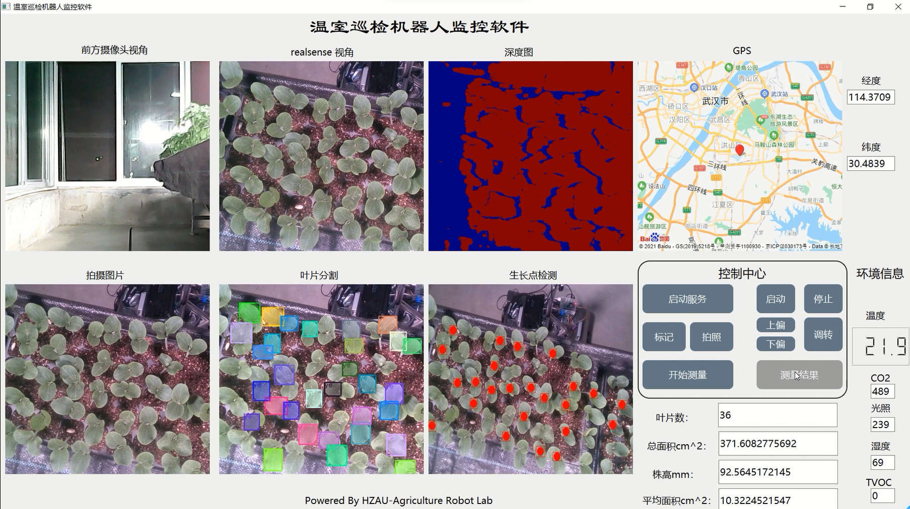

# 表型巡检机器人

通过WiFi+socket连接笔记本和树莓派，进行图传和下达小车控制指令。

笔记本环境：windows，树莓派官方镜像

## PYQT界面

- 前方摄像头视角：获取与树莓派连接的usb摄像头的画面

- realsense视角：获取与树莓派连接的realsense画面；深度图则是将图传的深度图进行可视化后进行展示的

- GPS：使用的百度地图api

- 拍摄图片：点击”控制中心“的拍摄之后可以在此处区域显示

- 叶片分割：调用maskrcnn模型，对”拍摄图片“里的内容进行识别

- 生长点分割：调用center net模型，对叶片的生长点进行识别

**控制中心：**

- 启动服务：向树莓派端发送socket连接请求（需要在树莓派端开启service监听）

- 拍照：对当前的realsense**彩色图**和**深度图**进行拍照

- 开始测量：开启多个线程，调用模型进行叶片计数和分割，总面积、平均面积则是通过调用pcl点云库的三角化算法获得

- 测量结果：将测量到的结果通过excel展示

## 各个文件夹

1. Fuwuqi：部署在云服务器端的，控制mysql服务器
2. laptop：上位机软件
3. raspberry：树莓派端控制软件
4. whole2：Android app

